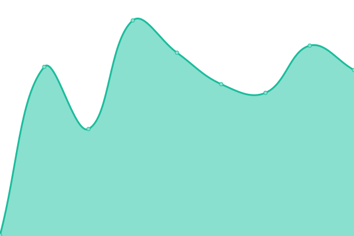
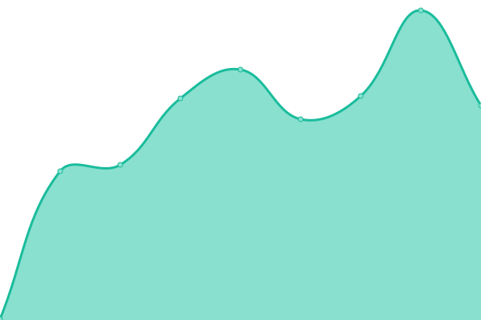
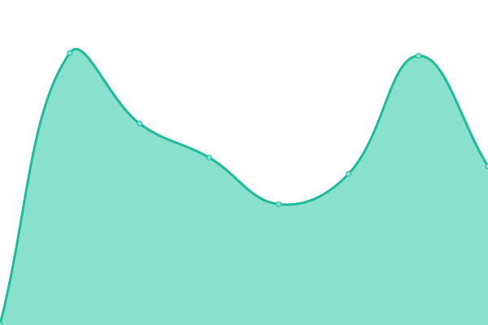

# [📈 Live Status](https://status.mineversal.com): <!--live status--> **🟩 All systems operational**

This repository contains the open-source uptime monitor and status page for [Mineversal](https://mineversal.com), powered by [Upptime](https://github.com/upptime/upptime).

With [Upptime](https://upptime.js.org), you can get your own unlimited and free uptime monitor and status page, powered entirely by a GitHub repository. We use [Issues](https://github.com/Mineversal/Mineversal-Status/issues) as incident reports, [Actions](https://github.com/Mineversal/Mineversal-Status/actions) as uptime monitors, and [Pages](https://status.mineversal.com) for the status page.

<!--start: status pages-->
<!-- This summary is generated by Upptime (https://github.com/upptime/upptime) -->
<!-- Do not edit this manually, your changes will be overwritten -->
<!-- prettier-ignore -->
| URL | Status | History | Response Time | Uptime |
| --- | ------ | ------- | ------------- | ------ |
|  [Mineversal](https://mineversal.com) | 🟩 Up | [mineversal.yml](https://github.com/Mineversal/Mineversal-Status/commits/HEAD/history/mineversal.yml) | 

 164ms
     
 | 

<a href="https://status.mineversal.com/history/mineversal">100.00%</a>
    

|  [Mineversal Shortlink](https://mineversal.org) | 🟩 Up | [mineversal-shortlink.yml](https://github.com/Mineversal/Mineversal-Status/commits/HEAD/history/mineversal-shortlink.yml) | 

 263ms
     
 | 

<a href="https://status.mineversal.com/history/mineversal-shortlink">100.00%</a>
    

|  [Al-Jazari Virtual Assistant](https://mineversal.net) | 🟩 Up | [al-jazari-virtual-assistant.yml](https://github.com/Mineversal/Mineversal-Status/commits/HEAD/history/al-jazari-virtual-assistant.yml) | 

 289ms
     
 | 

<a href="https://status.mineversal.com/history/al-jazari-virtual-assistant">100.00%</a>
    

|  [Votie](https://votie.mineversal.com) | 🟩 Up | [votie.yml](https://github.com/Mineversal/Mineversal-Status/commits/HEAD/history/votie.yml) | 

 116ms
     
 | 

<a href="https://status.mineversal.com/history/votie">100.00%</a>
    

<!--end: status pages-->

[**Visit our status website →**](https://status.mineversal.com)

## 📄 License

- Powered by: [Upptime](https://github.com/upptime/upptime)
- Code: [MIT](./LICENSE) © [Anand Chowdhary](https://anandchowdhary.com), supported by [Pabio](https://pabio.com)
- Data in the `./history` directory: [Open Database License](https://opendatacommons.org/licenses/odbl/1-0/)
